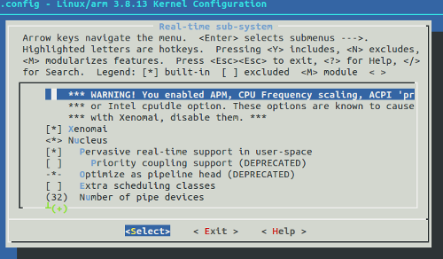
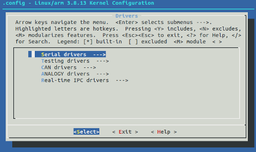

RaspbianXenomai
=================
Patch Raspbian OS with official Xenomai patches, compile and run into Raspberry Pi.

Features
========
* Raspbian Linux 3.8.13

* Patch Xenomai-2.6

* Configure Xenomai

* Enable/Disable Xenomai RT drivers
  
  
  
  

Usage
=====
To run and compile Raspbian RT:

```groovy
  ./compile.sh
```
This generates two files:
  
    build/
        *|---> kernel.img   
        *|---> modules.tar.gz
        
  *Replace kernel.img in the boot partition
  
  *Unzip the modules in file system partition

```groovy
uname -a 
  Linux raspberrypi 3.8.13xenomai #1 Mon Jan 5 01:35:34 CET 2015 armv6l GNU/Linux
```
# High resolution test with cyclictest

All tests have been run on Raspberry Pi 1 model B

Test case: clock_nanosleep(TIME_ABSTIME), Interval 10000 microseconds,. 10000 loops, no load.
```groovy
pi@raspberrypi ~ $ sudo cyclictest -t1 -p 80 -n -i 10000 -l 10000

```
Test case: clock_nanosleep(TIME_ABSTIME), Interval 10000 micro seconds,. 10000 loops, 100% load.
```groovy
pi@raspberrypi ~ $ cyclictest -t1 -p 80 -n -i 10000 -l 10000

```
Test case: POSIX interval timer, Interval 10000 micro seconds,. 10000 loops, no load.
```groovy
pi@raspberrypi ~ $ cyclictest -t1 -p 80 -i 10000 -l 10000

```
Test case: POSIX interval timer, Interval 10000 micro seconds,. 10000 loops, 100% load.
```groovy
pi@raspberrypi ~ $ cyclictest -t1 -p 80 -i 10000 -l 10000

```
